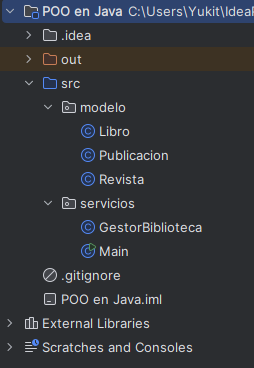
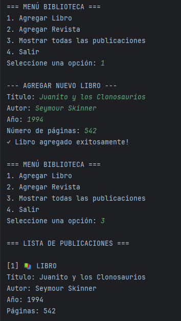

 <h1 align="center" style="font-size: 2em; margin-bottom: 20px;">
  🏫 Ejercicio Guiado de POO en Java 🏫
</h1>

## 📋 Descripción
Un ejercicio práctico para aprender los fundamentos de la Programación Orientada a Objetos en Java, centrado en:
- **Modificadores de acceso** (public, protected, private, default)
- **Herencia** entre clases
- **Encapsulación** de datos
- **Polimorfismo** mediante métodos sobrescritos

## 🎯 Objetivos de Aprendizaje
- Comprender la visibilidad de atributos y métodos
- Implementar relaciones de herencia entre clases
- Practicar el uso de getters y setters
- Crear colecciones de objetos utilizando polimorfismo
- Manejar entrada de datos con Scanner

## 🏗️ Estructura del Proyecto
```
src/
├── modelo/
│ ├── Publicacion.java (Clase base abstracta)
│ ├── Libro.java (Subclase con atributos específicos)
│ └── Revista.java (Subclase con atributos específicos)
└── servicios/
├── GestorBiblioteca.java (Gestión de colecciones)
└── Main.java (Clase principal para pruebas)
```
## 📚 Conceptos Clave Practicados

### 1. **Modificadores de Acceso**
| Modificador | Visibilidad |
|-------------|-------------|
| `public`    | En cualquier parte del proyecto |
| `default`   | Solo dentro del mismo paquete |
| `protected` | Dentro del paquete + subclases |
| `private`   | Solo dentro de la clase |

### 2. **Herencia**
- `Libro` y `Revista` extienden de `Publicacion`
- Uso de `super()` para llamar al constructor de la clase padre
- Sobrescritura de métodos con `@Override`

### 3. **Encapsulación**
- Atributos privados con getters y setters públicos
- Control del acceso a los datos internos

### 4. **Polimorfismo**
- Uso de `ArrayList<Publicacion>` para almacenar diferentes tipos
- Llamadas a métodos sobrescritos mediante la referencia de la clase base

## 🚀 Instrucciones de Ejecución

### Requisitos
- Java JDK 8 o superior
- IDE (IntelliJ, Eclipse, VS Code) o editor de texto

### Pasos para ejecutar
1. Clonar o descargar el proyecto
2. Ejecutar con IntelliJ 

## 📸 Capturas de Pantalla

### Captura 1: Estructura del Proyecto



### Captura 2: Ejecución del Programa

